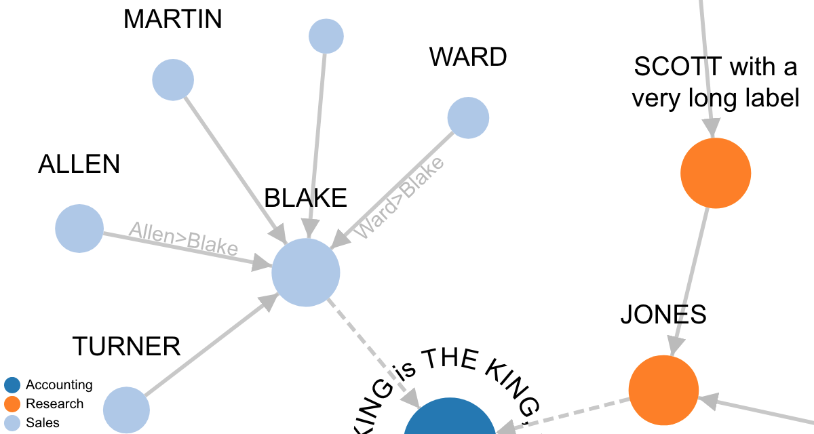

First of all: Thanks to the community!

From time to time someone has new ideas or questions about the D3 network chart. Some time ago I thought my D3 implementation is more or less feature complete. But in the last weeks I worked again on the code to bring in new feature wishes from the community.

The most visible one in the new version 3.1 is the ability to add labels to links - see the links between Allen, Blake and Ward in the screenshot above. The labels are positioned in a way that they are always readable - this is the reason why they appear sometimes above and sometimes below a link line (they are rotated, if needed). The nice thing is that you can also read both labels when you have links in both directions between two nodes. The other benefit of having labels on links is that they extend the area for the link click and hover events. This improves the usabiltiy in cases where the links should show a tooltip when they are hovered or some action should be executed when they are clicked. This is normally not so easy because the links are so narrow.

There are also new helper methods and one new option - for the full change log see the project on [GitHub][1] and for online demos either the [standalone version in the docs][2] or the APEX plug-in version on [apex.oracle.com][3].

Happy networking :-)

Ottmar

[1]: https://github.com/ogobrecht/d3-force-apex-plugin#changelog
[2]: https://ogobrecht.github.io/d3-force-apex-plugin/tutorial-1-getting-started.html
[3]: https://apex.oracle.com/pls/apex/f?p=18290:1
