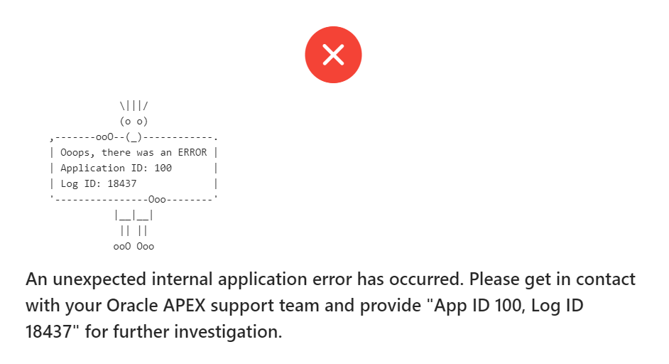







## Einleitung

Es sieht so aus, als wäre es ein Hobby von PL/SQL-Entwicklern ein eigenes Logging-Tool zu entwickeln. Es gibt schon einige freie Tools auf dem Markt und wahrscheinlich viele, die nie veröffentlicht wurden ([DOAG-Vortrag von Sabine Heimsath zum Thema](https://www.doag.org/formes/pubfiles/10101682/2018-SQLPLSQL-Sabine_Heimsath-PL_SQL__Monitoren__gt__Messen__gt__Optimieren_-_mit_Open_Source-Praesentation.pdf)):

- [Logger](https://github.com/OraOpenSource/Logger)
- [PIT](https://github.com/j-sieben/PIT/)
- [Instrumentation for PLSQL](https://github.com/connormcd/instrumentation)
- [Log4plsql](https://github.com/alangibson/log4plsql)
- [ILO](https://sourceforge.net/projects/ilo/)
- [BMC_DEBUG](https://sites.google.com/site/oraplsqlinst/)
- ...

Ein Grund dafür scheint zu sein, dass jeder unterschiedliche Vorstellungen oder Bedürfnisse hat. Bei mir ist es so, dass ich ein Logging Tool haben wollte, was sehr einfach zu installieren ist und auch dann funktioniert, wenn man keinen Kontext in der Datenbank anlegen darf und auch keine besonderen Leserechte für administrative Views wie z.B. v$session hat. Man benötigt nur die Rechte zur Erstellung von Tabellen und Packages sowie optional einem Bereinigungsjob - ziemlicher Standard. Trotzdem ist es möglich, einzelne Nutzer/Sessions für Debugging-Zwecke in einen höheren Log-Level zu versetzen. Da das über den Client-Identifier gelöst ist, funktioniert das auch in einer Umgebung ohne feste Session-ID wie z.B. APEX. Sollte in einer Umgebung kein Client-Identifier gesetzt sein, dann vergibt Console einfach selber einen. Seine Konfiguration liest Console aus einer Tabelle mit nur einer Zeile unterstützt durch den Result-Cache. Das stellt eine resourcenschonende Ausführung sicher. Auch die Prüfung, ob eine Log-Message aufgrund des aktuellen Log-Levels wirklich in die Log-Tabelle geschrieben wird ist hochoptimiert, um in Produktionsumgebungen den Overhead so gering wie möglich zu halten.

## Ein einziges Installationsskript

Für Console werden alle Skripte in ein einziges Installationsskript zusammengeführt. Da SQLcl auch Skripte aus dem Internet laden kann, könnte man das Tool in einer Minute ohne vorherigen Download auch so installieren: SQLcl aufrufen, im gewünschten Schema anmelden und `@https://raw.githubusercontent.com/ogobrecht/console/main/install/create_console_objects.sql` aufrufen. Ein paar Sekunden später kann man schon loslegen mit dem Logging. Möchte man es in APEX installieren und hat nur einen Browserzugang zu seiner Entwicklungsumgebung, dann ist das einzelne Installtionsskript im SQL Workshop auch sehr hilfreich und Console schnell installiert.

## Produktionssicher ohne weitere Konfiguration

Console loggt per Default nur Fehler (Level 1). Damit ist man auf Produktivsystemen ohne weitere Einstellung auf der sicheren Seite. Möchte man aber auf einem Entwicklungssystem auch andere Level wie Warning (2), Info (3), Debug (4) oder Trace (5) aktivieren und dies nicht für jede Session einzeln tun müssen, dann kann man das global einstellen: `exec console.conf(p_level => 3);`. Mehr dazu in der Package-Beschreibung zur Prozedur [console.conf](https://github.com/ogobrecht/console/blob/main/docs/package-console.md#procedure-conf).

Um eine Session (Client Identifier) in einen höheren Log-Level zu versetzen benutzt man die Prozedur [console.init](https://github.com/ogobrecht/console/blob/main/docs/package-console.md#procedure-init). Lässt man den Parameter `p_client_identifier` weg, dann wird automatisch der Client Identifier der eigenen Session genommen - hier ein Beispiel:

```sql
-- Dive into your own session with the default log level of 3 (info) and the
-- default duration of 60 (minutes).
exec console.init;

-- With level 4 (debug) for the next 15 minutes.
exec console.init(4, 15);

-- Using a constant for the level
exec console.init(console.c_level_debug, 90);

-- Debug an APEX session...
begin
  console.init(
    p_client_identifier => 'OGOBRECHT:8805903776765',
    p_level             => console.c_level_debug,
    p_duration          => 15
    -- there are more parameters availabe... 
  );
end;
/
```

Nun stellt sich die Frage, wie man an den Client-Identifier einer fremdem Session kommt ohne Leserechte auf adminstrative Views wie z.B. v$session. Eine Variante wäre, das zum Beispiel in das Frontend einer Anwendung zu schreiben mit `sys_context('USERENV', 'CLIENT_IDENTIFIER')` - z.B. in den Footer oder auf eine Hilfe-Seite.

Möchte man zurückkehren in den normalen Modus der globalen Einstellungen aller Sessions, dann kann man das mit [console.exit](https://github.com/ogobrecht/console/blob/main/docs/package-console.md#procedure-exit) tun.

Man sollte die Prozeduren `console.conf`, `init` und `exit` nicht in seiner Business-Logik verwenden - sie dienen ausschließlich zum managen von Session-Einstellungen und für Debugging-Zwecke und sollten daher nur interaktiv oder in SQL-Skripten verwendet werden.

## Methodennamen angelehnt an JavaScript Console

Console verwendet so viele Methodennamen aus dem JavaScript-Console wie möglich - damit sollte der Wechsel zwischen Backendcode und Frontendcode nicht so schwer fallen was die Methodennamen angeht. Ob die Methoden wirklich etwas in die Logtabelle CONSOLE_LOGS schreiben, hängt vom aktiven Log-Level ab - daher erst noch einmal diese:

- Level 1: Error
- Level 2: Warning
- Level 3: Info
- Level 4: Debug (anstelle von verbose in der JavaScript Console)
- Level 5: Trace (gibt es nicht in der JavaScript Console)

Die Haupt-Instrumentierungsmethoden:

- console.error_save_stack (dazu gleich mehr):
- console.error (level error)
- console.warn (level warning)
- console.info & log (level info)
- console.debug (level debug)
- console.trace (level trace)
- console.count & count_reset
- console.count_current & count_end (level info)
- console.count_current & count_end (function overloads, independent of log level)
- console.time & time_reset
- console.time_current & time_end (level info)
- console.time_current & time_end (function overloads, independent of log level)
- console.table# (level info)
- console.assert & assertf
- console.format
- console.add_param

Mehr in der [API-Übersicht](https://github.com/ogobrecht/console/blob/main/docs/api-overview.md).

## Reduzierte Menge Logeinträge durch gespeicherten Call Stack

Console nutzt die Möglichkeiten des Packages `sys.utl_call_stack` um die Anzahl der Logeinträge auf ein mögliches Minimum zu reduzieren. Wer kennt es nicht, das Problem: Im Fehlerfall wird in jeder Unterfunktion ein Logeintrag erstellt, um möglichst viele Details festzuhalten. Am Ende muss man dann zusehen, wie so die Logtabelle zugemüllt wird und man versucht aus den vielen Log-Einträgen herauszufinden, wo denn nun genau der Fehler aufgetreten ist.

Es wäre hilfreich, im Error Backtrace auch die Methodennamen zu sehen - die Datenbank schreibt aber nur die Packagenamen und die Zeilennummer in den Backtrace. Um dieses Problem zu umgehen bietet Console die Möglichkeit anstatt in den Untermethoden einen Fehler in die Log-Tabelle zu schreiben, den Call-Stack mit dem Aufruf `console.error_save_stack` so lange zwischenzuspeichern, bis final in der äußersten Hauptmethode `console.error` aufgerufen wird, was dann den Fehler inklusive gespeichertem Call Stack in die Log-Tabelle einträgt. Zur Verdeutlichung hier ein Skript mit einem Testpackage:

```sql
set define off
set feedback off
set serveroutput on
set linesize 120
set pagesize 40
column call_stack heading "Call Stack" format a120
whenever sqlerror exit sql.sqlcode rollback

prompt TEST ERROR_SAVE_STACK

prompt - compile package spec
create or replace package some_api is
  procedure do_stuff;
end;
/

prompt - compile package body
create or replace package body some_api is
------------------------------------------------------------------------------
    procedure do_stuff is
    --------------------------------------
        procedure sub1 is
        --------------------------------------
            procedure sub2 is
            --------------------------------------
                procedure sub3 is
                begin
                  console.assert(1 = 2, 'Demo');
                exception --sub3
                  when others then
                    console.error_save_stack;
                    raise;
                end;
            --------------------------------------
            begin
              sub3;
            exception --sub2
              when others then
                console.error_save_stack;
                raise;
            end;
        --------------------------------------
        begin
          sub2;
        exception --sub1
          when others then
            console.error_save_stack;
            raise no_data_found;
        end;
    --------------------------------------
    begin
      sub1;
    exception --do_stuff
      when others then
        console.error;
        raise;
    end;
------------------------------------------------------------------------------
end;
/

prompt - call the package
begin
  some_api.do_stuff;
exception
  when others then
    null; --> I know, I know, never do that without a final raise...
          --> But we want only test our logging without killing the script run...
end;
/

prompt - FINISHED, selecting now the call stack from the last log entry...

select call_stack from console_logs order by log_id desc fetch first row only;
```

Hier die Ausgabe des obigen Skriptes - der Abschnitt "Saved Error Stack" ist die Besonderheit von Console, die drei anderen Stack- und Trace-Abschnitte sind die Standards der Datenbank:

```bash
TEST ERROR_SAVE_STACK
- compile package spec
- compile package body
- call the package
- FINISHED, selecting now the call stack from the last log entry...

Call Stack
------------------------------------------------------------------------------------------------------------------------
#### Saved Error Stack

- PLAYGROUND.SOME_API.DO_STUFF.SUB1.SUB2.SUB3, line 14 (line 11, ORA-20777 Assertion failed: Demo)
- PLAYGROUND.SOME_API.DO_STUFF.SUB1.SUB2, line 22 (line 19)
- PLAYGROUND.SOME_API.DO_STUFF.SUB1, line 30 (line 27)
- PLAYGROUND.SOME_API.DO_STUFF, line 38 (line 35, ORA-01403 no data found)

#### Call Stack

- PLAYGROUND.SOME_API.DO_STUFF, line 38
- __anonymous_block, line 2

#### Error Stack

- ORA-01403 no data found
- ORA-06512 at "PLAYGROUND.SOME_API", line 31
- ORA-20777 Assertion failed: Test assertion with line break.
- ORA-06512 at "PLAYGROUND.SOME_API", line 23
- ORA-06512 at "PLAYGROUND.SOME_API", line 15
- ORA-06512 at "PLAYGROUND.CONSOLE", line 750
- ORA-06512 at "PLAYGROUND.SOME_API", line 11
- ORA-06512 at "PLAYGROUND.SOME_API", line 19
- ORA-06512 at "PLAYGROUND.SOME_API", line 27

#### Error Backtrace

- PLAYGROUND.SOME_API, line 31
- PLAYGROUND.SOME_API, line 23
- PLAYGROUND.SOME_API, line 15
- PLAYGROUND.CONSOLE, line 750
- PLAYGROUND.SOME_API, line 11
- PLAYGROUND.SOME_API, line 19
- PLAYGROUND.SOME_API, line 27
- PLAYGROUND.SOME_API, line 35
```

Nutzt man nicht `console.error_save_stack` sondern immer nur `console.error`, dann erhält man im Log wenigstens immer die drei letzten Abschnitte - und das ohne extra Arbeit im Code. Man muss sich dafür nur `console.error` merken.

## Einfaches loggen von Methodenparametern

Console bietet auch eine einfache Möglichkeit Methodenparameter zu loggen. Hier eine Beispiel-Prozedur mit Parametern aller unterstützten Typen:

```sql
--create demo procedure
create or replace procedure demo_proc (
  p_01 varchar2                       ,
  p_02 number                         ,
  p_03 date                           ,
  p_04 timestamp                      ,
  p_05 timestamp with time zone       ,
  p_06 timestamp with local time zone ,
  p_07 interval year to month         ,
  p_08 interval day to second         ,
  p_09 boolean                        ,
  p_10 clob                           ,
  p_11 xmltype                        )
is
begin
  raise_application_error(-20999, 'Test Error.');
exception
  when others then
    console.add_param('p_01', p_01);
    console.add_param('p_02', p_02);
    console.add_param('p_03', p_03);
    console.add_param('p_04', p_04);
    console.add_param('p_05', p_05);
    console.add_param('p_06', p_06);
    console.add_param('p_07', p_07);
    console.add_param('p_08', p_08);
    console.add_param('p_09', p_09);
    console.add_param('p_10', p_10);
    console.add_param('p_11', p_11);
    console.error('Ooops, something went wrong');
    raise;
end demo_proc;
/
```

In der Ausnahmebehandlung kann man schön erkennen, dass man immer die gleiche Prozedur `console.add_param` aufruft und den Namen und den Wert übergibt. Die Parameter werden in einem Array im Console-Package zwischengespeichert (gekürzt auf maximal 2000 Zeichen) und beim nächsten Aufruf einer Log-Methode (error, warn, info, log, debug oder trace) übernommen. Möchte man nicht, dass die Parameter gekürzt werden, so steht es einem frei den Parameter direkt in die Log-Nachricht zu schreiben - diese ist vom Typ Clob und unterliegt somit keiner Größenbeschränkung.

Hier ein Beispiel-Aufruf der obigen Prozedur:

```sql
begin
  demo_proc (
    p_01 => 'test vc2'                             ,
    p_02 => 1.23                                   ,
    p_03 => sysdate                                ,
    p_04 => systimestamp                           ,
    p_05 => systimestamp                           ,
    p_06 => localtimestamp                         ,
    p_07 => interval '4-2' year to month           ,
    p_08 => interval '7 6:12:42.123' day to second ,
    p_09 => true                                   ,
    p_10 => to_clob('test clob')                   ,
    p_11 => xmltype('<test_xml/>')                 );
end;
/
```

Dieser Aufruf schreibt dann folgende Log-Nachricht - siehe Spalte MESSAGE:


## Markdown-Format für automatisch ermittelte Metadaten

Dem aufmerksamen Leser dürfte nicht entgangen sein, dass die obige Log-Nachricht in Markdown formatiert ist. Wer möchte, kann also seinen Report entsprechend in HTML rendern lassen (z.B. in APEX) - gut lesbar ist es aber auch in Textform. Die Markdown-Tabellenform wie im obigen Beispiel nutzt Console auch für das Loggen weiterer Metadaten wie z.B. APEX-Umgebung, CGI-Umgebung, User-Umgebung und Console-Umgebung. All diese Umgebungen können für jeden einzelnen Log-Aufruf eingeschaltet werden. Sie werden dann an die Log-Nachricht angehängt wie die Parameter. Hier beispielhaft die Signatur der Error-Prozedur:

```sql
procedure error (
  p_message         in clob     default null  , -- The log message itself
  p_permanent       in boolean  default false , -- Should the log entry be permanent (not deleted by purge methods)
  p_call_stack      in boolean  default true  , -- Include call stack
  p_apex_env        in boolean  default false , -- Include APEX environment
  p_cgi_env         in boolean  default false , -- Include CGI environment
  p_console_env     in boolean  default false , -- Include Console environment
  p_user_env        in boolean  default false , -- Include user environment
  p_user_agent      in varchar2 default null  , -- User agent of browser or other client technology
  p_user_scope      in varchar2 default null  , -- Override PL/SQL scope
  p_user_error_code in integer  default null  , -- Override PL/SQL error code
  p_user_call_stack in varchar2 default null    -- Override PL/SQL call stack
);
```

## Erweiterbare Logs durch überladene Log-Methoden

Die Error-Prozedur hat eine Überladung in Form einer Funktion, die die Log-ID zurückliefert. Somit kann man das Logging auch mit eigenen Daten in eigenen Tabellen erweitern z.B. für einen nachgelagerten Freigabeprozess im Falle von spezifischen Fehlern. Dafür ist dann auch der Parameter `p_permanent` gedacht, der dafür sorgt, das der Aufräumjob oder die Prozeduren `console.purge` und `console.purge_all` die entsprechend markierten Log-Einträge nicht löscht und diese permanent zur Verfügung stehen. Alle anderen Log-Methoden (warn, info, log, debug, trace) sind in gleicher Weise und mit den gleichen Parametern implementiert - haben aber teilweise andere Standardwerte. Bei der Error-Methode wird der Call-Stack geschrieben, bei der Trace-Methode alle vier Umgebungsdetails.

Die Parameter `p_user_agent`, `p_user_scope`, `p_user_error_code` und `p_user_call_stack` sind dafür gedacht, auch externe Log-Ereignisse erfassen und die automatisch ermittelten Werte der PL/SQL-Umgebung überschreiben zu können. Als Beispiel sei ein externer Ladeprozess in einem Data-Warhouse genannt oder Fehlermeldungen aus dem JavaScript-Frontend einer Anwendung. Mit ein wenig Phantasie werden hier jedem eigene Anwendungsfälle in den Sinn kommen...

## Zeit messen und Dinge zählen

Ausführungszeiten messen und Dinge zählen sind sehr häufig gebrauchte Funktionen. Console kann hier helfen, nicht zu viele Hilfsvariablen erstellen zu müssen und den Code kurz und knapp zu halten. Dazu bietet es die Prozeduren `time`, `count` und weitere Helfer an. Man kann bequem mehrere Timer oder Counter parallel betreiben - sie werden jeweils über ein optionales Label identifiziert. Lässt man das Label weg, dann wird intern das Label `default`. Am besten verdeutlicht das wohl ein wenig Beispielcode:

```sql
begin
  --basic usage
  console.time;
  sys.dbms_session.sleep(0.1);
  console.time_end; -- without optional label and message

  console.time('myTimer');
  sys.dbms_session.sleep(0.1);
  console.time_current('myTimer'); -- without optional message

  sys.dbms_session.sleep(0.1);
  console.time_current('myTimer', 'end of step two');

  sys.dbms_session.sleep(0.1);
  console.time_end('myTimer', 'end of step three');
end;
/
```

Dies führt zu folgenden Lognachrichten in der Tabelle console_logs, wenn der aktuelle Log-Level 3 (info) oder höher ist:

- default: 00:00:00.102508
- myTimer: 00:00:00.108048
- myTimer: 00:00:00.212045 - end of step two
- myTimer: 00:00:00.316084 - end of step three

Manchmal möchte man aber keine vorgefertigten Logeinträge haben oder benötigt die verstrichene Zeit, um sie in Scripten in den Serveroutput zu schreiben. Hierfür gibt die im Code verwendeten Prozeduren `time_current` und `time_end` auch in Form von überladenen Funktionen. Mit denen kann man dann machen, was man möchte:

```sql
set serveroutput on

begin
  console.time;

  --console.print is an alias for sys.dbms_output.put_line
  console.print('Processing step one...');
  sys.dbms_session.sleep(0.1);
  console.print('Elapsed: ' || console.time_current);

  console.print('Processing step two...');
  sys.dbms_session.sleep(0.1);
  console.print('Elapsed: ' || console.time_current);

  console.print('Processing step three...');
  sys.dbms_session.sleep(0.1);
  console.print('Elapsed: ' || console.time_end);
end;
/
```

Das führt dann in etwa zu so einem Serveroutput:

```bash
Processing step one...
Elapsed: 00:00:00.105398
Processing step two...
Elapsed: 00:00:00.209267
Processing step three...
Elapsed: 00:00:00.313301
```

Zum Zählen von Dingen oder Vorgängen gibt es die gleichen Prozeduren und Funktionen wie für die Zeitmessungen - nur eben mit dem prefix `count` anstelle von `time` (wir verwenden im Beispiel die Variante ohne Label):

```sql
set serveroutput on

begin
  console.print('Counting nonsense...');

  for i in 1 .. 1000 loop
    if mod(i, 3) = 0 then
      console.count;
    end if;
  end loop;
  console.print('Current value: ' || console.count_current );

  console.count_reset;

  for i in 1 .. 10 loop
    console.count;
  end loop;
  console.print('Final value: ' || console.count_end );
end;
/
```

Das ergibt dann einen Serveroutput wie folgt:

```bash
Counting nonsense...
Current value: 333
Final value: 10
```

Die im Beispiel verwendete Prozedur `count_reset` gibt es auch für Timer und heißt dort `time_reset`. Die jeweiligen `*_end`-Methoden löschen den Eintrag aus der im Console-Package verwalteten Liste von Timern/Countern.

## Assert, format und andere Helferlein

Es gibt noch weitere Hilfsmethoden, die das Entwicklerleben angenehmer machen. Zuerst sei die Assert-Prozedur genannt. Dieses immer wiederkehrende Muster sollte jeder kennen:

```sql
if not x < y then
  raise_application_error(-20999, 'x should be less then y');
else
  -- your code here
end if;
```

Besonders hässlich wird es, wenn man mehrere Bedingungen prüfen muss. Das ganze kann man auch als Einzeiler formulieren:

```sql
console.assert(x < y, 'x should be less then x');
```

Möchte man Texte mit dynamischen Informationen anreichern, dann ist man schnell in der Verknüpfungshölle:

```sql
console.assert(
  x < y, 
  'x should be less then y (x='
  || to_char(x)
  || ', y='
  || to_char(y)
  || ')'
);
```

Hier kann einem dann die `format` Funktion helfen:

```sql
console.assert(
  x < y, 
  console.format(
    'X should be less then Y (x=%s, y=%s)',
    to_char(x),
    to_char(y)
  )
);
```

`format` akzeptiert bis zu 10 Parameter und arbeitet nach folgenden Regeln:

1. Ersetze alle Vorkommen von `%0` .. `%9` mit den entsprechenden Parameter `p0` ... `p9`
2. Ersetze `%n` durch neue Zeilen (Zeilenvorschubzeichen)
3. Ersetze alle Vorkommen von `%s` in positioneller Reihenfolge durch die entsprechenden Parameter mit sys.utl_lms.format_message - siehe auch die [Oracle docs](https://docs.oracle.com/en/database/oracle/oracle-database/19/arpls/UTL_LMS.html#GUID-88FFBFB6-FCA4-4951-884B-B0275BD5DF44)

Ich persönlich tippe sehr ungern `dbms_output.put_line`. Console schreibt zwar mit allen Log-Methoden in eine Log-Tabelle, aber eigentlich legt das Wort Console ja nahe, dass wir auch direkt in den Serveroutput schreiben können, oder? Dafür gibt es dann die Prozedur `print`:

```sql
console.print('A message');
```

Dann gibt es noch die Kurzformen von `console.print(console.format(...))` und `console.assert([boolean expression], console.format(...))`:

```sql
console.printf(
  'A dynamic message with a %n second line of text: %s',
  my_var
);

console.assertf(
  x < y, 
  'x should be less then y (x=%s, y=%s)',
  to_char(x),
  to_char(y)
);
```

Auch häufig gebraucht wird eine schnelle, gecachte Clob-Verknüpfung - da kann dann Console mit [clob_append](https://github.com/ogobrecht/console/blob/main/docs/package-console.md#procedure-clob_append) & [clob_flush_cache](https://github.com/ogobrecht/console/blob/main/docs/package-console.md#procedure-clob_flush_cache) helfen.

Mehr gibt es in der [API-Übersicht](https://github.com/ogobrecht/console/blob/main/docs/api-overview.md).

## Anzeigen des Package-Status von Console in einer Session

Wer sich dafür interessiert, was in der aktuellen Session von Console konfiguriert ist, kann sich das mit einer Pipelined Table Function anschauen oder in seiner Anwendung mit einem Report zur Verfügung stellen:

```sql
select * from table(console.status);
```

| ATTRIBUTE                | VALUE               |
|--------------------------|---------------------|
| c_version                | 1.0.0               |
| localtimestamp           | 2021-10-03 13:58:00 |
| sysdate                  | 2021-10-03 11:58:00 |
| g_conf_check_sysdate     | 2021-10-03 11:58:10 |
| g_conf_exit_sysdate      | 2021-10-03 12:58:00 |
| g_conf_client_identifier | {o,o} 11ECD3500002  |
| g_conf_level             | 5                   |
| level_name(g_conf_level) | trace               |
| g_conf_check_interval    | 10                  |
| g_conf_enable_ascii_art  | true                |
| g_conf_call_stack        | false               |
| g_conf_user_env          | false               |
| g_conf_apex_env          | false               |
| g_conf_cgi_env           | false               |
| g_conf_console_env       | false               |
| g_counters.count         | 1                   |
| g_timers.count           | 2                   |
| g_saved_stack.count      | 0                   |
| g_prev_error_msg         |                     |

## APEX Error Handling Function

Für APEX bringt Console eine sogenannte "[Error Handling Function](https://docs.oracle.com/en/database/oracle/application-express/20.2/aeapi/Example-of-an-Error-Handling-Function.html#GUID-2CD75881-1A59-4787-B04B-9AAEC14E1A82)" mit, die Fehler innerhalb der APEX-Laufzeitumgebung in die Log-Tabelle eintragen kann. Wer das nutzen möchte, muss diese Funktion in seiner Anwendung im "Application Builder" unter "Edit Application Properties > Error Handling > Error Handling Function" eintragen: `console.apex_error_handling`.





Die Error Handling Function protokolliert den technischen Fehler in der Tabelle CONSOLE_LOGS und schreibt eine freundliche Nachricht an den Endbenutzer. Sie nutzt das APEX Text Message Feature für die benutzerfreundlichen Meldungen im Falle von Constraint-Verletzungen, wie beschrieben in [diesem Video](https://www.insum.ca/episode-22-error-handling/) von Anton und Neelesh von Insum, welches wiederum auf einer Idee von Roel Hartman in [diesem Blog Beitrag](https://roelhartman.blogspot.com/2021/02/stop-using-validations-for-checking.html) basiert. Die APEX-Community rockt...

## APEX Plug-In für die Erfassung von Frontend-Fehlern

Desweiteren gibt es noch ein APEX Dynamic Action Plug-In, welches JavaScript-Fehler im Browser der Anwender per AJAX-Call in die Log-Tabelle einträgt. Damit bekommt man auch mit, wenn es im Frontend bei den Anwendern nicht so richtig rund läuft...

Es muss sichergestellt sein, dass Console entweder im Parsing-Schema der Anwendung installiert ist oder ein Synonym namens CONSOLE im Parsing-Schema erstellt wurde, welches auf das Package CONSOLE verweist. Dann können Sie das Plug-in unter `install/apex_plugin.sql` installieren und eine Dynamic Action für die gesamte Anwendung auf Seite null erstellen:

- Event: Page Load
- Action: Oracle Instrumentation Console [Plug-In]
- Keine weiteren Anpassungen erforderlich (es wird nur eine JavaScript-Datei geladen)

Wer sich dafür interessiert, was das Plug-In macht: `sources/apex_plugin_console.js`. Dies ist derzeit eine minimale Implementierung und kann in Zukunft verbessert werden.

## Inspirationsquellen

Ich bin nicht allein auf der Welt und ohne die Anderen geht auch bei der Softwareentwicklung nicht viel. Hier ein paar Links zu Seiten oder Projekten, die mich auf dem Weg zu einem eigenen Logging-Tool inspiriert haben:

- [JavaScript Console API](https://developers.google.com/web/tools/chrome-devtools/console/api)
- [Logger](https://github.com/OraOpenSource/Logger)
- [Instrumentation for PLSQL](https://github.com/connormcd/instrumentation)
- [PIT](https://github.com/j-sieben/PIT/)
- [Oracle Magazine - Sophisticated Call Stack Analysis](https://blogs.oracle.com/oraclemagazine/post/sophisticated-call-stack-analysis)

Ein besonderer Dank geht an [Dietmar Aust](https://twitter.com/daust_de), der mir in einer frühen Phase Zeit und Ideen mit einer Diskussionssitzung geschenkt hat.

## Projekt-Homepage

Console ist auf [GitHub](https://github.com/ogobrecht/console) gehostet.

Viel Spaß beim Loggen und Fehler suchen :-)

Ottmar
