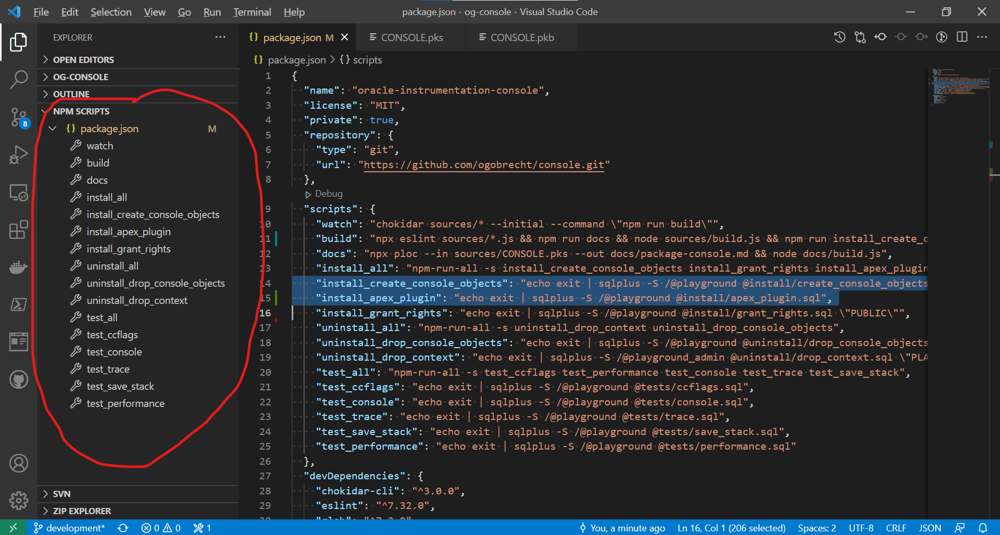



## Introduction

Everyone who develops plug-ins for APEX knows the problem: Once a plug-in is finished, future maintenance is usually just a matter of uploading updated JavaScript files to the plug-in and finally downloading the plug-in to make it available to others. This can be a very time consuming process when troubleshooting or implementing a new feature.

So for my latest open source project, I thought about how to shorten the whole process. I already had a file watcher and a build script running anyway, which, when source files are changed, merges the entire project into a single SQL install script. The plug-in was just about updating a JavaScript file (normal and minified). The PL/SQL code for the plug-in is in a package and only referenced - this is also a good approach for performance reasons ([Blog post by Daniel Hochleitner on the topic](https://blog.danielhochleitner.de/2018/02/11/oracle-apex-plugin-performance/)).

## Creating a template from the existing plug-in

So I downloaded the finished plug-in once and stored it as a template in the project directory. Then I looked at how the files are stored in the SQL script of the plug-in:


```sql
begin
  wwv_flow_api.g_varchar2_table := wwv_flow_api.empty_varchar2_table;
  wwv_flow_api.g_varchar2_table(1) := '766172206f69633d7b6f633a7b7d2c6f613a7b7d2c6c6e3a7b7d7d3b6f69632e6c6e2e6572726f723d312c6f69632e6c6e2e7761726e696e673d322c6f69632e6c6e2e696e666f3d332c6f69632e6c6e2e64656275673d342c6f69632e6c6e2e74726163';
  wwv_flow_api.g_varchar2_table(2) := '653d352c6f69632e746f537472696e673d66756e6374696f6e2872297b666f7228766172206f3d22222c653d303b653c722e6c656e6774683b652b2b296f2b3d30213d3d653f2220223a22222c226f626a656374223d3d747970656f6620725b655d3f6f';
  wwv_flow_api.g_varchar2_table(3) := '2b3d225c6e222b4a534f4e2e737472696e6769667928725b655d2c6e756c6c2c32293a6f2b3d725b655d3b72657475726e206f7d2c6f69632e696e69743d66756e6374696f6e28297b6f69632e6d6573736167653d66756e6374696f6e28722c6f2c652c';
  /* snip */
  wwv_flow_api.g_varchar2_table(14) := '2e6c6e2e6572726f722c722c6e2c692e737461636b292c21317d7d3b';
end;
/

begin
  wwv_flow_api.create_plugin_file(
    p_id           => wwv_flow_api.id(37195131994077352)                           ,
    p_plugin_id    => wwv_flow_api.id(36295154520053378)                           ,
    p_file_name    => 'console.min.js'                                             ,
    p_mime_type    => 'application/javascript'                                     ,
    p_file_charset => 'utf-8'                                                      ,
    p_file_content => wwv_flow_api.varchar2_to_blob(wwv_flow_api.g_varchar2_table) );
end;
/



It looks like we have to encode the files somehow - but how? If you take a closer look at the characters, you will notice at some point that only the digits 0 to 9 and the letters a to f are used. So it seems to be a hexadecimal encoding - with 200 characters in each block. 

Ok, then in the template we replace the first anonymous PL/SQL block with a placeholder:


```sql
#CONSOLE_JS_FILE_MIN#

begin
  wwv_flow_api.create_plugin_file(
    p_id           => wwv_flow_api.id(37195131994077352)                           ,
    p_plugin_id    => wwv_flow_api.id(36295154520053378)                           ,
    p_file_name    => 'console.min.js'                                             ,
    p_mime_type    => 'application/javascript'                                     ,
    p_file_charset => 'utf-8'                                                      ,
    p_file_content => wwv_flow_api.varchar2_to_blob(wwv_flow_api.g_varchar2_table) );
end;
/
```


Now we need some code to replace the placeholder with the converted source file.

## JavaScript helper functions for conversion

Since I implemented the file watcher and other scripts with Node.js/npm, it was obvious to solve this in JavaScript as well. First the needed modules and a md5 hash function:

```js
const fs = require('fs');
const UglifyJS = require('uglify-js');
const crypto = require('crypto');
const toMd5Hash = function (string) { return crypto.createHash('md5').update(string).digest('hex') };
let consoleJsCode, minified, version, md5Hash, conf;
```

Then we need a helper function that breaks a string into blocks of 200 characters and returns it as an array:

```js
const toChunks = function (text, size) {
    const numChunks = Math.ceil(text.length / size);
    const chunks = new Array(numChunks);
    for (let i = 0, start = 0; i < numChunks; ++i, start += size) {
        chunks[i] = text.substr(start, size);
    }
    return chunks;
};
```

Finally, our actual function, which hexadecimally encodes a string (read file) and puts it into the required SQL script form:

```js
const toApexPluginFile = function (text) {
    const hexString = new Buffer.from(text).toString('hex');
    const chunks = toChunks(hexString, 200);
    let apexLoadFile = 'begin\n' +
        '  wwv_flow_api.g_varchar2_table := wwv_flow_api.empty_varchar2_table;\n';
    for (let i = 0; i < chunks.length; ++i) {
        apexLoadFile += `  wwv_flow_api.g_varchar2_table(${(i + 1)}) := '${chunks[i]}';\n`;
    }
    apexLoadFile += 'end;\n/';
    return apexLoadFile;
};
```

## Build script to build the plug-in when changes are made in the source code.

Everything is assembled by the build script - here is the relevant snippet:


```js
console.log('- build file install/apex_plugin.sql');
consoleJsCode = fs.readFileSync('sources/apex_plugin_console.js', 'utf8');
version = fs.readFileSync('sources/CONSOLE.pks', 'utf8').match(/c_version\s+constant.*?'(.*?)'/)[1];
md5Hash = toMd5Hash(consoleJsCode);
// reading the last saved version and md5Hash values as a reference for the comparison
conf = JSON.parse(fs.readFileSync('apexplugin.json', 'utf8'));
if (conf.version !== version || conf.jsFile.md5Hash !== md5Hash) {
    minified = UglifyJS.minify({ "console.js": consoleJsCode }, { sourceMap: true });
    if (minified.error) throw minified.error;
    conf.version = version;
    conf.jsFile.md5Hash = md5Hash;
    conf.jsFile.version += 1;
    fs.writeFileSync('install/apex_plugin.sql',
        '--DO NOT CHANGE THIS FILE - IT IS GENERATED WITH THE BUILD SCRIPT sources/build.js\n\n' +
        fs.readFileSync('sources/apex_plugin_template.sql', 'utf8')
            .replace('#CONSOLE_VERSION#', conf.version)
            .replace('#FILE_VERSION#', conf.jsFile.version)
            .replace('#CONSOLE_JS_FILE#', toApexPluginFile(fs.readFileSync('sources/apex_plugin_console.js', 'utf8')))
            .replace('#CONSOLE_JS_FILE_MIN#', toApexPluginFile(minified.code))
            .replace('#CONSOLE_JS_FILE_MIN_MAP#', toApexPluginFile(minified.map))
    );
    fs.writeFileSync('apexplugin.json', JSON.stringify(conf, null, 2));
}
```


It should be noted that we will also have to manage the file version itself - APEX will install it as we create it. For that purpose, we check by means of hash-function whether JavaScript source file has changed and only then we regenerate the plug-in (including minification). This way, we avoid unnecessarily regenerating the plug-in every time we change source code in the repository and thus incrementing the file version.In the build script snippet above, the current file version and hash value is stored in a JSON file (`apexplugin.json`, last line of code) so that we can use this as a reference in the next build.


Here is the relevant place in the plug-in template where the file version is entered by the build script (placeholder `#FILE_VERSION#`, last parameter):


```sql
prompt - application/shared_components/plugins/dynamic_action/com_ogobrecht_console
begin
  wwv_flow_api.create_plugin (
    p_id                        => wwv_flow_api.id(36295154520053378)     ,
    p_plugin_type               => 'DYNAMIC ACTION'                       ,
    p_name                      => 'COM.OGOBRECHT.CONSOLE'                ,
    p_display_name              => 'Oracle Instrumentation Console'       ,
    p_supported_ui_types        => 'DESKTOP:JQM_SMARTPHONE'               ,
    p_api_version               => 2                                      ,
    p_render_function           => 'console.apex_plugin_render'           ,
    p_ajax_function             => 'console.apex_plugin_ajax'             ,
    p_substitute_attributes     => true                                   ,
    p_subscribe_plugin_settings => true                                   ,
    p_version_identifier        => '#CONSOLE_VERSION#'                    ,
    p_about_url                 => 'https://github.com/ogobrecht/console' ,
    p_files_version             => #FILE_VERSION#                         );
end;
/
```


In addition, the version number of the plug-in itself is also updated here (placeholder `#CONSOLE_VERSION#`, third last parameter) - but this depends on the respective circumstances of the project. In my case I write the version number of the PL/SQL package CONSOLE also into the plug-in depending on it - so if the version number of the package changes, the plug-in will be rebuilt as well. But here everybody has to see what is needed in the project.

When saving source code changes, the file watcher starts and triggers the build script. This then builds two installation SQL scripts together: That of the logging tool itself (not the focus of this article) and then that for the plug-in. Following this, both scripts are then installed in a dev environment. For this, of course, the default workspace stored in the plug-in and the default application number must be present in the dev environment.

## NPM scripts for orchestration

I now often manage build and install scripts with the node package manager npm. The reason for this is the good integration with Visual Studio Code, the operating system independence and the possibility to orchestrate the scripts a bit - ok, you have to install Node.js, but don't you always? With one click you can either start the watch task, which does everything automatically with every save of a source file, or you can conveniently call the scripts individually. If someone else looks into the repository, it is also clearer with the npm scripts what works here and how.





It's also clear that you don't write usernames and passwords into the scripts here anymore - that's already forbidden in principle when the code is checked into version control. On the screenshot you can (hopefully) see that here a wallet with the alias `playground` is used. For those who only use the instant client and have problems setting up a wallet: [How to use mkstore and orapki with Oracle Instant Client](https://ogobrecht.com/posts/2020-07-29-how-to-use-mkstore-and-orapki-with-oracle-instant-client/).

The scripts are managed in the file `package.json` on the top level of the project directory. If you want to read more about npm scripts, you can start here:

- [Introduction to NPM Scripts](https://medium.freecodecamp.org/introduction-to-npm-scripts-1dbb2ae01633)
- [Why I Left Gulp and Grunt for npm Scripts](https://medium.freecodecamp.org/why-i-left-gulp-and-grunt-for-npm-scripts-3d6853dd22b8)
- [Why npm Scripts?](https://css-tricks.com/why-npm-scripts/)

## A complete example

For those who want to see how everything can work together: I took the examples here in the article from my open source project [Oracle Instrumentation Console](https://github.com/ogobrecht/console).

## Another way

My focus with this solution was to be able to supply a plug-in locally on the PC with new files. But there is another way: You can upload files or whole directories via script into an installed plug-in of an APEX application and then download the plug-in afterwards. For this purpose there is the Open Souce Project [APEX Publish Static Files](https://github.com/vincentmorneau/apex-publish-static-files) by Vincent Morneau. This project is also integrated with [APEX Nitro](https://github.com/OraOpenSource/apex-nitro) which can speed up frontend development in APEX.

Have fun generating plug-ins :-)

Ottmar
