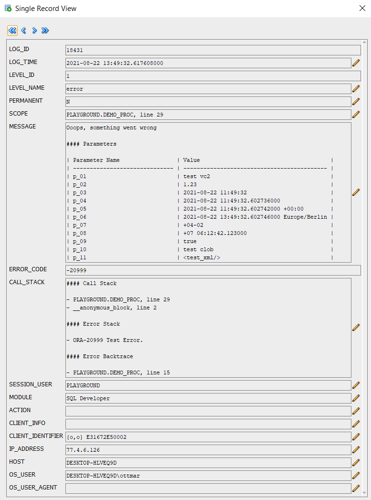





It looks like it is a hobby of PL/SQL developers to develop their own logging tool...

There are already some free tools on the market and probably many that have never been released:

- [Logger](https://github.com/OraOpenSource/Logger)
- [PIT](https://github.com/j-sieben/PIT/)
- [Instrumentation for PLSQL](https://github.com/connormcd/instrumentation)
- [Log4plsql](https://github.com/alangibson/log4plsql)
- [ILO](https://sourceforge.net/projects/ilo/)
- [BMC_DEBUG](https://sites.google.com/site/oraplsqlinst/)
- ...

One reason seems to be that everyone has different ideas or needs. In my case, I wanted a logging tool, which is very easy to install and works even if you are not allowed to create a context in the database. You only need the rights to create tables and packages and a cleanup job - pretty standard. A context is optional and will be used automatically if present.

Speaking of easy installation - since for Console all scripts are merged into a single installation script and SQLcl can also load scripts from the Internet, you could install the tool in a minute without downloading it first: Call SQLcl, log into the desired schema and call `@https://raw.githubusercontent.com/ogobrecht/console/main/install/create_console_objects.sql`. A few seconds later you can start logging. If you want to install it in APEX and have only browser access to your development environment, the single install script in SQL Workshop is also very helpful and Console installs quickly.

A note for those in a hurry: Console logs only errors (level 1) by default. This means that you are on the safe side on production systems without any further settings. But if you want to enable other levels like warning (2), info (3), debug (4) or trace (5) on a development system and don't want to do this for each session individually, you can set it globally: `exec console.conf_level(3);`. More about this in the [Getting Started](https://github.com/ogobrecht/console/blob/main/docs/getting-started.md) document.

Besides that I wanted to use the new possibilities of the package `utl_call_stack` to reduce the number of log entries to a possible minimum. Who doesn't know the problem: In case of an error, a log entry is created in each subfunction to record as many details as possible. In the end you have to watch how the log table gets cluttered and you try to find out from the many log entries where exactly the error occurred.

It would be helpful to see the method names in the error backtrace - but the database only writes the package names and the line number in the backtrace. To work around this problem Console offers the possibility instead of writing an error in the submethods into the log table, to save the call stack with the call `console.error_save_stack` until finally in the outermost main method `console.error` is called, which then enters the error including saved call stack into the log table. To illustrate this, here is a script with a test package:

```sql
set define off
set feedback off
set serveroutput on
set linesize 120
set pagesize 40
column call_stack heading "Call Stack" format a120
whenever sqlerror exit sql.sqlcode rollback

prompt TEST ERROR_SAVE_STACK

prompt - compile package spec
create or replace package some_api is
  procedure do_stuff;
end;
/

prompt - compile package body
create or replace package body some_api is
------------------------------------------------------------------------------
    procedure do_stuff is
    --------------------------------------
        procedure sub1 is
        --------------------------------------
            procedure sub2 is
            --------------------------------------
                procedure sub3 is
                begin
                  console.assert(1 = 2, 'Demo');
                exception --sub3
                  when others then
                    console.error_save_stack;
                    raise;
                end;
            --------------------------------------
            begin
              sub3;
            exception --sub2
              when others then
                console.error_save_stack;
                raise;
            end;
        --------------------------------------
        begin
          sub2;
        exception --sub1
          when others then
            console.error_save_stack;
            raise no_data_found;
        end;
    --------------------------------------
    begin
      sub1;
    exception --do_stuff
      when others then
        console.error;
        raise;
    end;
------------------------------------------------------------------------------
end;
/

prompt - call the package
begin
  some_api.do_stuff;
exception
  when others then
    null; --> I know, I know, never do that without a final raise...
          --> But we want only test our logging without killing the script run...
end;
/

prompt - FINISHED, selecting now the call stack from the last log entry...

select call_stack from console_logs order by log_id desc fetch first row only;
```

Here is the output of the above script - the Saved Error Stack section is Console's special feature, the other three stack and trace sections are the database's standards:


```bash
TEST ERROR_SAVE_STACK
- compile package spec
- compile package body
- call the package
- FINISHED, selecting now the call stack from the last log entry...

Call Stack
------------------------------------------------------------------------------------------------------------------------
#### Saved Error Stack

- PLAYGROUND.SOME_API.DO_STUFF.SUB1.SUB2.SUB3, line 14 (line 11, ORA-20777 Assertion failed: Demo)
- PLAYGROUND.SOME_API.DO_STUFF.SUB1.SUB2, line 22 (line 19)
- PLAYGROUND.SOME_API.DO_STUFF.SUB1, line 30 (line 27)
- PLAYGROUND.SOME_API.DO_STUFF, line 38 (line 35, ORA-01403 no data found)

#### Call Stack

- PLAYGROUND.SOME_API.DO_STUFF, line 38
- __anonymous_block, line 2

#### Error Stack

- ORA-01403 no data found
- ORA-06512 at "PLAYGROUND.SOME_API", line 31
- ORA-20777 Assertion failed: Test assertion with line break.
- ORA-06512 at "PLAYGROUND.SOME_API", line 23
- ORA-06512 at "PLAYGROUND.SOME_API", line 15
- ORA-06512 at "PLAYGROUND.CONSOLE", line 750
- ORA-06512 at "PLAYGROUND.SOME_API", line 11
- ORA-06512 at "PLAYGROUND.SOME_API", line 19
- ORA-06512 at "PLAYGROUND.SOME_API", line 27

#### Error Backtrace

- PLAYGROUND.SOME_API, line 31
- PLAYGROUND.SOME_API, line 23
- PLAYGROUND.SOME_API, line 15
- PLAYGROUND.CONSOLE, line 750
- PLAYGROUND.SOME_API, line 11
- PLAYGROUND.SOME_API, line 19
- PLAYGROUND.SOME_API, line 27
- PLAYGROUND.SOME_API, line 35
```

If you don't use `console.error_save_stack` but always `console.error`, then you get at least the last three sections in the log - and without extra work in the code. You only have to remember `console.error`.

By the way, remember - I intentionally reused as many method names from the JavaScript Console as possible - so switching between backend code and frontend code shouldn't be that hard as far as method names are concerned. An [API Overview](https://github.com/ogobrecht/console/blob/main/docs/api-overview.md) and a [Getting Started](https://github.com/ogobrecht/console/blob/main/docs/getting-started.md) document help with the first steps.

Console also provides an easy way to log method parameters. Here is a sample procedure with parameters of all supported types:

```sql
--create demo procedure
create or replace procedure demo_proc (
  p_01 varchar2                       ,
  p_02 number                         ,
  p_03 date                           ,
  p_04 timestamp                      ,
  p_05 timestamp with time zone       ,
  p_06 timestamp with local time zone ,
  p_07 interval year to month         ,
  p_08 interval day to second         ,
  p_09 boolean                        ,
  p_10 clob                           ,
  p_11 xmltype                        )
is
begin
  raise_application_error(-20999, 'Test Error.');
exception
  when others then
    console.add_param('p_01', p_01);
    console.add_param('p_02', p_02);
    console.add_param('p_03', p_03);
    console.add_param('p_04', p_04);
    console.add_param('p_05', p_05);
    console.add_param('p_06', p_06);
    console.add_param('p_07', p_07);
    console.add_param('p_08', p_08);
    console.add_param('p_09', p_09);
    console.add_param('p_10', p_10);
    console.add_param('p_11', p_11);
    console.error('Ooops, something went wrong');
    raise;
end demo_proc;
/
```

In the exception handling you can see nicely that you always call the same procedure `console.add_param` and pass the name and the value. The parameters are cached in an array in the console package (shortened to a maximum of 2000 characters) and taken over with the next call of a log method (error, warn, info, log, debug or trace). If you don't want the parameters to be truncated, you are free to write the parameter directly into the log message - this is of type clob and is therefore not subject to any size restrictions.

Here an example call of the above procedure:

```sql
begin
  demo_proc (
    p_01 => 'test vc2'                             ,
    p_02 => 1.23                                   ,
    p_03 => sysdate                                ,
    p_04 => systimestamp                           ,
    p_05 => systimestamp                           ,
    p_06 => localtimestamp                         ,
    p_07 => interval '4-2' year to month           ,
    p_08 => interval '7 6:12:42.123' day to second ,
    p_09 => true                                   ,
    p_10 => to_clob('test clob')                   ,
    p_11 => xmltype('<test_xml/>')                 );
end;
/
```

This call then writes the following log message - see the MESSAGE column:



The attentive reader might have noticed that the log messages are formatted in Markdown. So if you like, you can have your report rendered accordingly in HTML (e.g. in APEX) - but it's also readable in text form. The Markdown table format as in the example above is also used by Console for logging other metadata such as APEX environment, CGI environment, user environment and console environment. All of these environments can be turned on for each individual log call. They are then appended to the log message like the parameters. Here exemplarily the signature of the error procedure:

```sql
procedure error (
  p_message         in clob     default null  , -- The log message itself
  p_permanent       in boolean  default false , -- Should the log entry be permanent (not deleted by purge methods)
  p_call_stack      in boolean  default true  , -- Include call stack
  p_apex_env        in boolean  default false , -- Include APEX environment
  p_cgi_env         in boolean  default false , -- Include CGI environment
  p_console_env     in boolean  default false , -- Include Console environment
  p_user_env        in boolean  default false , -- Include user environment
  p_user_agent      in varchar2 default null  , -- User agent of browser or other client technology
  p_user_scope      in varchar2 default null  , -- Override PL/SQL scope
  p_user_error_code in integer  default null  , -- Override PL/SQL error code
  p_user_call_stack in varchar2 default null    -- Override PL/SQL error stack
);
```

The error procedure has an overload in the form of a function that returns the log ID. Thus one can extend the logging also with own data in own tables e.g. for a downstream check process in case of specific errors. This is also the purpose of the `p_permanent` parameter, which ensures that the cleanup job or the `console.purge` and `console.purge_all` procedures do not delete the correspondingly marked log entries and that these are permanently available. All other log methods (warn, info, log, debug, trace) are implemented in the same way and with the same parameters - but some have different default values. For the error method the call stack is written, for the trace method all environments.

The parameters `p_user_agent`, `p_user_scope`, `p_user_error_code` and `p_user_call_stack` are intended to also capture external log events and to be able to overwrite the automatically determined values of the PL/SQL environment. As an example an external load process in a data warehouse or error messages from the JavaScript frontend of an application can be mentioned. With a little imagination, everyone will come up with their own use cases here...

It remains to mention that Console for APEX comes along with a so-called "Error Handling Function" that can enter errors within the APEX runtime environment into the log table. If you want to use this, you have to enter this function in your application in the "Application Builder" under "Edit Application Properties > Error Handling > Error Handling Function": `console.apex_error_handling`.

Furthermore, there is an APEX Dynamic Action Plug-In which enters JavaScript errors in the user's browser into the log table via AJAX call. This way you also get to know if the frontend is not running smoothly...

Console is hosted on [GitHub](https://github.com/ogobrecht/console).

Happy logging and debugging...

Ottmar
